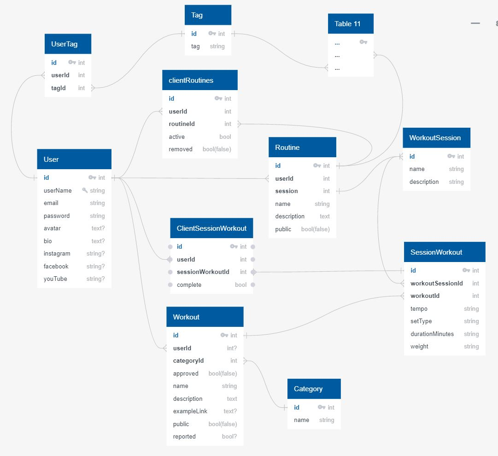

## 

# Schema

## Tables
* User
  > The user table will store any information directly and only pertains to the user, name, display photo, bio, social media links etc...
* Routine
  > Routines will contain multiple workout sessions grouping them under one name with a description to show users the broad overview of the workout program
* Workout
  > Each workout will have at the least a name, category, and description, ideally the workouts will also have a link that shows a user how to perform the exercise visually
* Session
  > Each session will contain multiple workouts and will be capable of storing information pertaining to the single day/workout session such as muscle groups that are being targeted or just a daily goal
* Category
  > Categories will allow for efficient grouping of exercises aiding the the build process of each workout session and easing the burden of searching through existing workouts
* Tag
  > Tags will provide users with a way to flag themselves and their routines with short descriptors that may help others who are searching for like-minded workouts

## Join Tables
* UserRoutine
  > User Routines will join many routines to many users allowing users to follow and participate in routines that are available to them but not directly created by them
* UserSession
  > User Sessions will allow a completed status for an entire day's worth of UserExercises
* UserExercise
  > User session workout is designed to join user to a join table SessionWorkout, ideally this will make it much easier to record user statistics and display information to the user as to which workouts they have completed. This will also be used to collect the user's overall statistics
* Exercise
  > Session Workout is designed to join many workouts to many workoutsessions collecting additional information on the workout specific to the session, in this way a user can select a workout and modify sub-information such as time/reps/setType on a workout without altering the workout directly, only the session workout
* UserTag
  > Joins users to tags in a many to many relationship
* RoutineTag
  > As above so below, this joins routines to tags

> ## User

| Column | Data Type | Nullable | Unique | Key | Default |
|--------|-----------|----------|--------|-----|---------|
| id | integer | F | T | PK | serial |
| username | string | F | T | | |
| email | string | F | T |  | |
| hashed_password | string | F | F | | |
| avatar_url | text | T | F | | |
| bio | text | T | F | | |
| instagram | string | T | F | | |
| facebook | string | T | F | | |
| youTube | string | T | F | | |
| updatedAt | datetype | F | F | | new Date() |
| createdAt | datetype | F | F | | new Date() |

> ## Routine
| Column | Data Type | Nullable | Unique | Key | Default |
|--------|-----------|----------|--------|-----|---------|
| id | integer | F | T | PK | serial |
| userId | integer | F | F | FK(User) | |
| name | string | F | F | | |
| description | text | F | F | | |
| public | bool | F | F | | False |
| reported | bool | F | F | | False |
| updatedAt | datetype | F | F | | new Date() |
| createdAt | datetype | F | F | | new Date() |

> ## UserRoutine
| Column | Data Type | Nullable | Unique | Key | Default |
|--------|-----------|----------|--------|-----|---------|
| id | integer | F | T | PK | serial |
| userId | integer | F | F | FK(User) | |
| routineId | integer | F | F | FK(Routine) | |
| active | boolean | F | F | | |
| complete | boolean | F | F | | False |
| rmoved | boolean | F | F | | False|
| updatedAt | datetype | F | F | | new Date() |
| createdAt | datetype | F | F | | new Date() |

> ## Session
| Column | Data Type | Nullable | Unique | Key | Default |
|--------|-----------|----------|--------|-----|---------|
| id | integer | F | T | PK | serial |
| routineId | integer | F | F | FK(Routine) | |
| name | string | F | F | | |
| description | text | F | F | | |
| updatedAt | datetype | F | F | | new Date() |
| createdAt | datetype | F | F | | new Date() |

> ## UserSession
| Column | Data Type | Nullable | Unique | Key | Default |
|--------|-----------|----------|--------|-----|---------|
| id | integer | F | T | PK | serial |
| userId | integer | F | F | FK(User) | |
| sessionId | integer | F | F | FK(Session) | |
| complete | boolean | F | F | | False |
| updatedAt | datetype | F | F | | new Date() |
| createdAt | datetype | F | F | | new Date() |

> ## Workout
| Column | Data Type | Nullable | Unique | Key | Default |
|--------|-----------|----------|--------|-----|---------|
| id | integer | F | T | PK | serial |
| userId | integer | F | F | FK(User) | |
| categoryId | integer | F | F | FK(Category) | |
| name | string | F | F | | |
| description | text | F | F | | |
| exampleLink | text | T | F | | |
| approved | boolean | F | F | | False |
| public | boolean | F | F | | False |
| reported | boolean | F | F | | False |
| updatedAt | datetype | F | F | | new Date() |
| createdAt | datetype | F | F | | new Date() |

> ## Category
| Column | Data Type | Nullable | Unique | Key | Default |
|--------|-----------|----------|--------|-----|---------|
| id | integer | F | T | PK | serial |
| name | string | F | T | | |
| updatedAt | datetype | F | F | | new Date() |
| createdAt | datetype | F | F | | new Date() |

> ## Exercise
| Column | Data Type | Nullable | Unique | Key | Default |
|--------|-----------|----------|--------|-----|---------|
| id | integer | F | T | PK | serial |
| sessionId | integer | F | F | FK(Session) | |
| workoutId | integer | F | F | FK(Workout)| |
|additional workout info| consult GF | !!! | !!! | !!! | !!!
| updatedAt | datetype | F | F | | new Date() |
| createdAt | datetype | F | F | | new Date() |

> ## UserExercise
| Column | Data Type | Nullable | Unique | Key | Default |
|--------|-----------|----------|--------|-----|---------|
| id | integer | F | T | PK | serial |
| userId | integer | F | F | FK(User) | |
| exerciseId | integer | F | F | FK(Exercise) | |
| complete | boolean | F | F | | False |
| updatedAt | datetype | F | F | | new Date() |
| createdAt | datetype | F | F | | new Date() |

> ## Tag
| Column | Data Type | Nullable | Unique | Key | Default |
|--------|-----------|----------|--------|-----|---------|
| id | integer | F | T | PK | serial |
| tag | string | F | T | | |
| updatedAt | datetype | F | F | | new Date() |
| createdAt | datetype | F | F | | new Date() |

> ## UserTag
| Column | Data Type | Nullable | Unique | Key | Default |
|--------|-----------|----------|--------|-----|---------|
| id | integer | F | T | PK | serial |
| tagId | integer | F | F | FK(Tag) | |
| userId | integer | F | F | FK(User)| |
| updatedAt | datetype | F | F | | new Date() |
| createdAt | datetype | F | F | | new Date() |

> ## RoutineTag
| Column | Data Type | Nullable | Unique | Key | Default |
|--------|-----------|----------|--------|-----|---------|
| id | integer | F | T | PK | serial |
| tagId | integer | F | F | FK(Tag) | |
| routineId | integer | F | F | FK(Routine) | |
| updatedAt | datetype | F | F | | new Date() |
| createdAt | datetype | F | F | | new Date() |

> ## Upvote
| Column | Data Type | Nullable | Unique | Key | Default |
|--------|-----------|----------|--------|-----|---------|
| id | integer | F | T | PK | serial |
| userId | integer | F | F | FK(User) | |
| routineId | integer | T | F | FK(Routine) | |
| workout Id | integer | T | F | FK(Workout) | |
| updatedAt | datetype | F | F | | new Date() |
| createdAt | datetype | F | F | | new Date() |

> ## Report
| Column | Data Type | Nullable | Unique | Key | Default |
|--------|-----------|----------|--------|-----|---------|
| id | integer | F | T | PK | serial |
| userId | integer | F | F | FK(User) | |
| routineId | integer | T | F | FK(Routine) | |
| workout Id | integer | T | F | FK(Workout) | |
| updatedAt | datetype | F | F | | new Date() |
| createdAt | datetype | F | F | | new Date() |

> ## Follow
| Column | Data Type | Nullable | Unique | Key | Default |
|--------|-----------|----------|--------|-----|---------|
| id | integer | F | T | PK | serial |
| followerId | integer | F | F | FK(User) | |
| followingId | integer | F | F | FK(User) | |
| updatedAt | datetype | F | F | | new Date() |
| createdAt | datetype | F | F | | new Date() |
