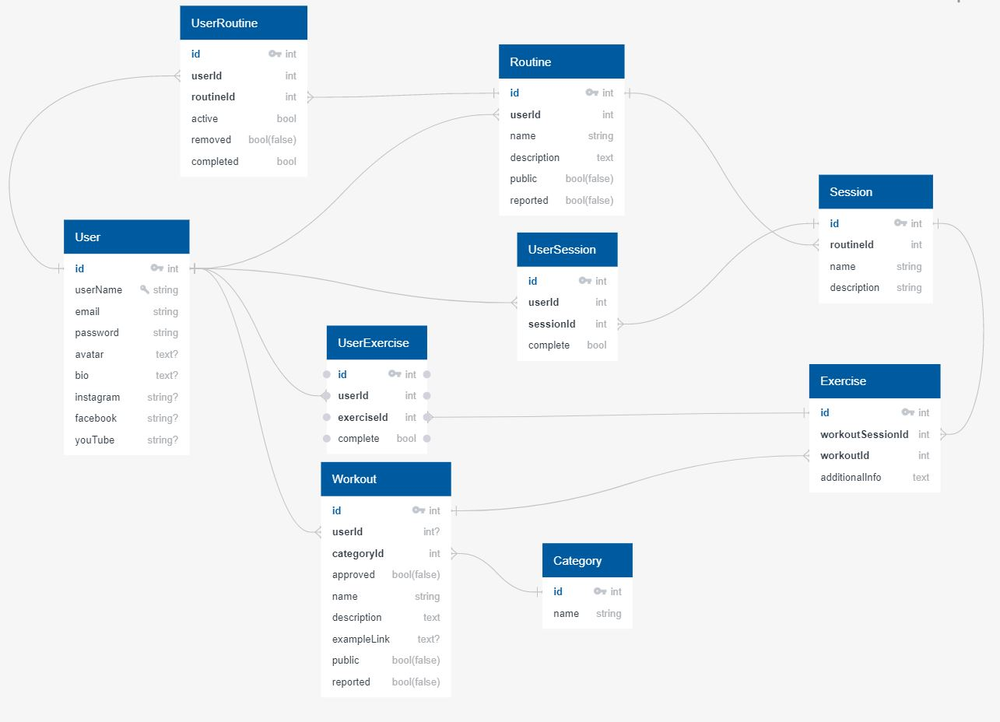

## 

# Schema

## Tables
* User
*

* Table 11 is a join table between Tag and Routine to allow routines to have multiple tags, the database diagram software used for this image requires a payment of $7 for access to more than ten tables, and as a struggling bootcamp student, that's just a bit outside my price range.

> ## User

| Column | Data Type | Nullable | Unique | Key | Default |
|--------|-----------|----------|--------|-----|---------|
| id | integer | F | T | PK | serial |
| username | string | F | T | | |
| email | string | F | T |  | |
| hashed_password | string | F | F | | |
| avatar_url | text | T | F | | |
| bio | text | T | F | | |
| instagram | string | T | F | | |
| facebook | string | T | F | | |
| youTube | string | T | F | | |
| updatedAt | datetype | F | F | | new Date() |
| createdAt | datetype | F | F | | new Date() |
