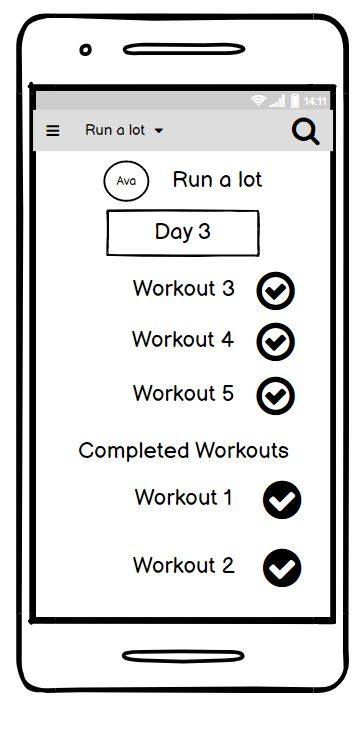

## 

# Wireframes
> # Login
>

> # SignUp
> 

> # Profile
> 

> # Routines
> 

> # Workouts
> 

> # Selected Routine
> 

> # Selected Session
> 

> # Create Routine
> 

> # Create Session
> 

> # Add Workout
> 

> # Create Workout
> 
